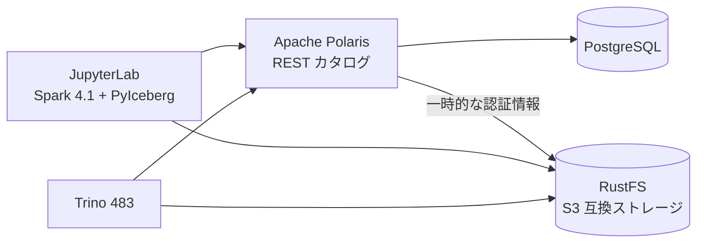

# apache-iceberg-hands-on

ローカル環境で Apache Iceberg のデータレイクハウスを動かし、Iceberg の主要な機能を手を動かして学ぶためのハンズオンです。
すべて無料で、アカウント登録なしで動きます。



| 役割 | 使うもの |
| --- | --- |
| テーブルフォーマット | Apache Iceberg 1.11（format v2） |
| クエリエンジン | Apache Spark 4.1.3（PySpark + JupyterLab）、Trino 483、PyIceberg 0.12 |
| カタログ | Apache Polaris 1.7（メタデータは PostgreSQL に保存） |
| ストレージ | RustFS 1.0（S3 互換、Web コンソール付き） |

構成の詳細と選定理由は [docs/design.md](docs/design.md) と [docs/adr/](docs/adr/) を参照してください。

## 前提条件

- Windows + WSL2（Ubuntu）、または Linux
- Docker Engine と Docker Compose v2
- `make`、`curl`
- メモリ: WSL2 に 7GB 以上（Spark と Trino を同時に動かすと合計 4〜5GB ほど使う）
- ディスク: 空き 10GB 以上（コンテナイメージとサンプルデータ）
- [uv](https://docs.astral.sh/uv/)（任意。ノートブックをコミットするときに実行結果を消す `nbstripout` を入れるのに使う）

## はじめかた

```sh
make setup      # .env を作る（uv があれば nbstripout も入れる）
make up-all     # 基盤 + Spark + Trino を起動（初回はイメージの取得とビルドで数分かかる）
make smoke      # 動作確認: Trino でテーブルを作って読み書きする
make data       # サンプルデータ（NYC タクシー、約 120MB）を data/ に取得する
```

`make smoke` の最後に `DROP TABLE` と表示されれば準備完了です。

| 画面 | URL | 備考 |
| --- | --- | --- |
| JupyterLab | <http://localhost:8888> | 認証なし。VS Code からは「既存の Jupyter サーバー」に `http://localhost:8888` を指定する |
| RustFS コンソール | <http://localhost:9001> | `.env` の `RUSTFS_ACCESS_KEY` / `RUSTFS_SECRET_KEY` でログイン |
| Spark UI | <http://localhost:4040> | ノートブックで Spark を使っている間だけ開ける |
| Trino UI | <http://localhost:8080> | ユーザー名は任意 |

ポートはすべて `127.0.0.1` にだけ公開しているので、同じ PC の外からは接続できません。

## ハンズオン

番号順に進めることを想定しています。各ディレクトリの README に手順があります。

| # | テーマ | 内容 |
| --- | --- | --- |
| 01 | [基本 CRUD](handson/01_basic_crud/) | CREATE / INSERT / UPDATE / DELETE / MERGE |
| 02 | [タイムトラベル](handson/02_time_travel/) | スナップショット、過去時点のクエリ、タグ、ロールバック |
| 03 | [スキーマ進化](handson/03_schema_evolution/) | 列の追加・名前変更・型の拡張・削除 |
| 04 | [パーティション進化](handson/04_partition_evolution/) | 隠しパーティション、パーティションの切り方の変更 |
| 05 | [相互運用](handson/05_interoperability/) | Spark と Trino で同じテーブルを読み書きする |
| 06 | [Parquet の変換](handson/06_parquet_conversion/) | CTAS と add_files |
| 07 | [メンテナンス](handson/07_maintenance/) | Compaction、スナップショットの失効、孤立ファイルの削除 |
| 08 | [メタデータテーブル](handson/08_metadata_tables/) | snapshots、manifests、files などで内部構造を覗く |
| 09 | [PyIceberg](handson/09_pyiceberg/) | Python だけで読み書きし、pandas / DuckDB で分析する |
| 10 | [v3 へのアップグレード](handson/10_v3_upgrade/)（追加目標） | 削除ベクトル、行の履歴 |

各回は、Spark のノートブック（`spark.ipynb`）と Trino の SQL（`trino.sql`）の組み合わせです。

- ノートブックは JupyterLab（または VS Code）で開いて上から実行する
- SQL は `make trino-sql FILE=handson/<回>/trino.sql` で実行する

## Make コマンド

Makefile は `docker compose` を呼ぶだけの薄いラッパーです。実際に実行されるコマンドは次のとおりです（`--profile` で起動するエンジンを選ぶ）。

| コマンド | 内容 | 実際のコマンド |
| --- | --- | --- |
| `make help` | 一覧を表示 | |
| `make setup` | 初回の準備 | `cp .env.example .env`、`uv sync`、`uv run nbstripout --install ...` |
| `make up` | 基盤だけを起動 | `docker compose up -d --wait` |
| `make up-spark` | 基盤 + Spark | `docker compose --profile spark up -d --wait` |
| `make up-trino` | 基盤 + Trino | `docker compose --profile trino up -d --wait` |
| `make up-all` | 基盤 + Spark + Trino | `docker compose --profile spark --profile trino up -d --wait` |
| `make down` | 停止（データは残る） | `docker compose --profile spark --profile trino down` |
| `make reset` | 完全に初期化（データも消す） | `docker compose --profile spark --profile trino down -v` |
| `make ps` | 状態を表示 | `docker compose ... ps -a` |
| `make logs S=polaris` | ログを表示 | `docker compose ... logs -f polaris` |
| `make trino-cli` | Trino CLI に接続 | `docker compose exec trino trino --catalog lakehouse --schema handson` |
| `make trino-sql FILE=...` | SQL ファイルを実行 | `docker compose exec -T trino trino ... < FILE` |
| `make smoke` | 動作確認 | `scripts/smoke.sql` を Trino で実行 |
| `make data` | サンプルデータを取得 | `scripts/download_data.sh` |

## 起動時に自動で行われること

`make up` のたびに、`polaris-setup` コンテナ（[docker/polaris/setup.sh](docker/polaris/setup.sh)）が次のものを作ります。すでにあるものはスキップされます。

- RustFS のバケット `warehouse`
- Polaris のカタログ `lakehouse`
- プリンシパル `handson_user`（認証情報は `.env` の `POLARIS_CLIENT_ID` / `POLARIS_CLIENT_SECRET`）
- ロールと権限
- 名前空間 `handson`

Polaris の権限モデルを知りたいときは、このスクリプトのコメントを読んでください。

## トラブルシューティング

| 症状 | 対処 |
| --- | --- |
| `make up` がタイムアウトする、コンテナが落ちる | `make ps` で状態を、`make logs S=<サービス名>` でログを見る。メモリが足りない場合は、エンジンを片方だけ起動する（`make up-spark` / `make up-trino`） |
| 状態がおかしくなった | `make reset` で完全に初期化してから `make up-all` |
| ノートブックで Trino の変更が見えない | Spark はテーブルのメタデータをキャッシュする。`REFRESH TABLE <テーブル名>` を実行する（05 を参照） |
| `data/` が見つからない | `make data` を実行する |
| WSL2 のメモリを増やしたい | Windows 側の `%UserProfile%\.wslconfig` の `[wsl2]` に `memory=8GB` などと書き、`wsl --shutdown` で再起動する |

## ドキュメント

- [docs/requirements.md](docs/requirements.md): 要件
- [docs/design.md](docs/design.md): 設計（バージョン、構成、設定）
- [docs/adr/](docs/adr/): 決定記録
- [docs/tasks.md](docs/tasks.md): タスク一覧
