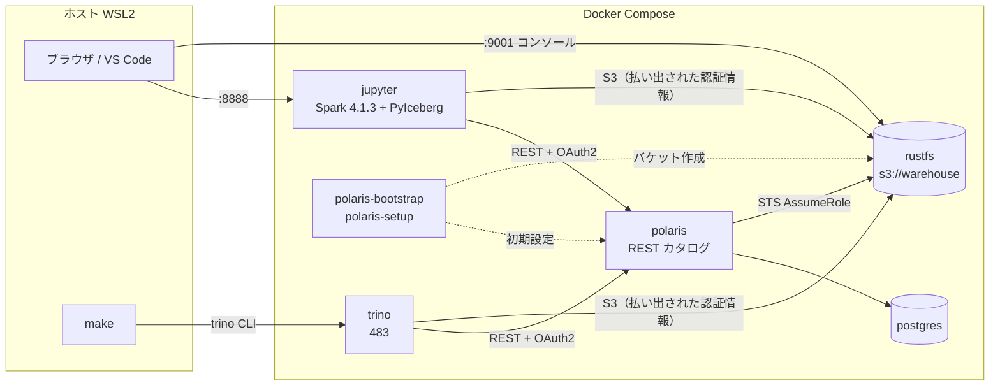

# 設計

> 状態: 確定（2026-09-26）。要件は [requirements.md](requirements.md) を参照。

## 技術スタック

すべてのバージョンを固定する。組み合わせを選んだ理由は [ADR 0002](adr/0002-version-matrix.md) に記録している。

| 役割 | 採用 | イメージ / アーティファクト | 決定記録 |
| --- | --- | --- | --- |
| テーブルフォーマット | Apache Iceberg 1.11.0（format v2） | `iceberg-spark-runtime-4.1_2.13`、`iceberg-aws-bundle` | [0002](adr/0002-version-matrix.md) |
| クエリエンジン | Spark 4.1.3（PySpark + JupyterLab） | `apache/spark:4.1.3-scala2.13-java17-python3-ubuntu` に JupyterLab を追加 | [0003](adr/0003-spark-official-image.md) |
| クエリエンジン | Trino 483 | `trinodb/trino:483`（CLI 同梱） | [0002](adr/0002-version-matrix.md) |
| 軽量クライアント | PyIceberg 0.12.0 | Jupyter コンテナに uv で追加 | [0004](adr/0004-pyiceberg-in-container.md) |
| カタログ | Apache Polaris 1.7.0 | `apache/polaris:1.7.0`、`apache/polaris-admin-tool:1.7.0` | [0002](adr/0002-version-matrix.md) |
| カタログ DB | PostgreSQL 18.6 | `postgres:18.6` | [0002](adr/0002-version-matrix.md) |
| ストレージ | RustFS 1.0.0 | `rustfs/rustfs:1.0.0` | [0001](adr/0001-object-storage-rustfs.md) |
| 初期化用 | curl | `alpine/curl:8.21.0` | — |
| 実行基盤 | Docker Compose + Make + uv | — | — |

## アーキテクチャ



- 各エンジンは Polaris から一時的な S3 の認証情報を受け取り（vended credentials）、RustFS を直接読み書きする。
- Polaris がクライアントに伝える S3 のエンドポイントは `http://rustfs:9000` の1つだけ。これが届くのはコンテナ内だけなので、Spark と PyIceberg はどちらも Jupyter コンテナで実行する（[ADR 0004](adr/0004-pyiceberg-in-container.md)）。Trino はエンドポイントを自分の設定から読むので影響を受けない。

## サービス構成

| サービス | profile | 公開ポート（`127.0.0.1`） | メモリ上限 | 役割 |
| --- | --- | --- | --- | --- |
| rustfs | 基盤 | 9000（S3）、9001（コンソール） | 512MB | オブジェクトストレージ |
| postgres | 基盤 | — | 256MB | Polaris のメタデータ |
| polaris-bootstrap | 基盤 | — | — | admin-tool で realm と root 認証情報を作って終了（再実行しても安全） |
| polaris | 基盤 | 8181（API） | 1GB（`-Xmx512m`） | Iceberg REST カタログ |
| polaris-setup | 基盤 | — | 64MB | curl でバケット・カタログ・プリンシパル・ロール・権限・名前空間を作る。完了後は待機し、ヘルスチェックで完了を示す |
| jupyter | `spark` | 8888（JupyterLab）、4040（Spark UI） | 2GB | Spark、PyIceberg。ホストの UID で動かし、`handson/` と `data/`（読み取り専用）をマウントする |
| trino | `trino` | 8080 | 2GB | Trino（single node） |

起動順はヘルスチェックと `depends_on` の条件で制御する。

`postgres`（healthy）→ `polaris-bootstrap`（completed）→ `polaris`（healthy）→ `polaris-setup`（healthy）→ `jupyter` / `trino`

データは名前付きボリュームで永続化する（`rustfs-data`、`postgres-data`）。

## Polaris の初期設定

`polaris-setup` の curl スクリプト（`docker/polaris/setup.sh`）が実行する。手順は Polaris 公式 Quickstart と同じで、各呼び出しの前に日本語で目的を書く。起動のたびに実行され、既に存在するもの（HTTP 409）はスキップする。

0. `warehouse` バケットを作る（curl の `--aws-sigv4` で署名した S3 API 呼び出し）
1. root の認証情報でトークンを取得する（`/api/catalog/v1/oauth/tokens`）
2. カタログ `lakehouse` を作る
   - `storageType: S3`、`allowedLocations: ["s3://warehouse"]`
   - `endpoint` / `endpointInternal`: `http://rustfs:9000`
   - `pathStyleAccess: true`、`region: us-east-1`
   - `polaris.config.drop-with-purge.enabled: true`（Trino の DROP TABLE はファイルごと削除するため）
3. プリンシパル `handson_user` を作り、リセット API（`/principals/{name}/reset`）で認証情報を `.env` の固定値に置き換える
4. プリンシパルロールとカタログロールを作って紐付け、カタログロールに `CATALOG_MANAGE_CONTENT` を付与する
5. `handson_user` の権限で名前空間 `handson` を作る

失敗したときの代替策: RustFS の STS が動かない場合は、カタログを `stsUnavailable: true` にして、各エンジンに静的な S3 キーを渡す。

## エンジンの接続設定

**Spark**（`spark-defaults.conf`）

- `spark.sql.catalog.lakehouse = org.apache.iceberg.spark.SparkCatalog`、`type=rest`、`uri=http://polaris:8181/api/catalog`、`warehouse=lakehouse`
- `credential`、`scope=PRINCIPAL_ROLE:ALL`、`header.X-Iceberg-Access-Delegation=vended-credentials`
- `spark.sql.extensions = org.apache.iceberg.spark.extensions.IcebergSparkSessionExtensions`
- Iceberg の jar はイメージのビルド時に Maven Central から取得して `$SPARK_HOME/jars` に置く
- 認証情報は環境変数から渡すため、`entrypoint.sh` が起動時にテンプレートから `spark-defaults.conf` を作る
- ホストの UID はコンテナ内に登録がなく Hadoop のログインが失敗するので、`entrypoint.sh` が起動時に `/etc/passwd` に登録する

**Trino**（`etc/catalog/lakehouse.properties`）

- `iceberg.catalog.type=rest`、`iceberg.rest-catalog.uri`、`warehouse`、`security=OAUTH2`、`oauth2.credential`、`oauth2.scope`、`oauth2.server-uri`
- `iceberg.rest-catalog.vended-credentials-enabled=true`
- `fs.s3.enabled=true`、`s3.endpoint=http://rustfs:9000`、`s3.region=us-east-1`、`s3.path-style-access=true`（Trino は払い出された認証情報のうちキーだけを使うので、エンドポイントなどはここに書く）
- `iceberg.add-files-procedure.enabled=true`（追加目標の `add_files` 用）

**PyIceberg**：カタログ設定を環境変数（`PYICEBERG_CATALOG__LAKEHOUSE__*`）で渡すので、`load_catalog("lakehouse")` だけで接続できる。S3 の設定は Polaris から払い出されるものを使う。

## Parquet から Iceberg への変換

詳細は [ADR 0005](adr/0005-parquet-conversion.md)。

| 方式 | 方法 | 位置づけ |
| --- | --- | --- |
| データを書き直す | Spark の CTAS（`data/` のローカル Parquet を読んで作る） | 必須 |
| データを書き直さない | PyIceberg の `add_files`（Parquet を `s3://warehouse/` の下にアップロードしてから登録する） | 必須 |
| データを書き直さない | Trino の `ALTER TABLE ... EXECUTE add_files` | 追加目標（任意） |

## テーブルフォーマット v3

v2 で統一する。v3 は追加目標（任意）で、v2 のテーブルを Spark か Trino でアップグレードする（PyIceberg はアップグレードできない）。

| エンジン | v3 の対応状況（2026-09） |
| --- | --- |
| Spark 4.1 + Iceberg 1.11 | 主要な機能に対応（削除ベクトル、行の履歴、variant） |
| Trino 483 | 実験的な対応（DML、`optimize`、メンテナンス処理）。v3 テーブルに `add_files` は使えない |
| PyIceberg 0.12 | v3 テーブルの作成と読み込みはできる。v2 からのアップグレードと variant 型は使えない |
| Polaris 1.7 | 制限は見つかっていない（明記はされていない） |

どのエンジンでも読めるように、v3 のハンズオンでは variant 型、ナノ秒のタイムスタンプ、地理空間型、列のデフォルト値を使わない。

## サンプルデータ

- NYC TLC Yellow Taxi の 2024-12 と 2025-01（各約 60MB、約 350 万行）
  - URL: `https://d37ci6vzurychx.cloudfront.net/trip-data/yellow_tripdata_YYYY-MM.parquet`（存在しない月は 403 を返す）
  - 2025-01 から `cbd_congestion_fee` 列が加わっているので、スキーマ進化の題材にする
- `make data` でホストの `data/` にダウンロードする（gitignore）。Jupyter コンテナには読み取り専用でマウントする（マウント先は実装時に決める）
- Spark 4 は ANSI SQL モードが標準で有効。不正な型変換はエラーになる

## Make コマンド

中身は `docker compose` を呼ぶだけの薄いラッパーにする。README には実際に実行されるコマンドも書く。

| コマンド | 内容 |
| --- | --- |
| `make help` | コマンドの一覧 |
| `make up` | 基盤を起動 |
| `make up-spark` / `make up-trino` / `make up-all` | 基盤とエンジンを起動 |
| `make down` | 停止（データは残る） |
| `make reset` | 完全に初期化（`down -v`） |
| `make trino-cli` | Trino CLI に接続 |
| `make trino-sql FILE=...` | SQL ファイルを実行 |
| `make data` | サンプルデータを取得 |
| `make smoke` | 動作確認（Trino でテーブルを作ってクエリを実行する） |
| `make logs` | ログを表示 |

## ディレクトリ構成

```text
compose.yaml
Makefile
.env.example              # ローカル専用の固定の認証情報（.env は gitignore）
pyproject.toml / uv.lock  # ホストの開発ツール（nbstripout など）
docker/
  jupyter/                # Dockerfile, pyproject.toml, uv.lock, spark-defaults.conf
  trino/                  # etc/catalog/lakehouse.properties など
  polaris/                # setup.sh（curl による初期設定）
scripts/                  # download_data.sh など
data/                     # サンプルデータ（gitignore）
handson/
  01_basic_crud/          # README.md, spark.ipynb, trino.sql
  02_time_travel/
  03_schema_evolution/
  04_partition_evolution/
  05_interoperability/
  06_parquet_conversion/
  07_maintenance/
  08_metadata_tables/
  09_pyiceberg/
  10_v3_upgrade/          # 追加目標（任意）
docs/
```

## 開発時のルール

- ノートブックの実行結果は `nbstripout` で消してからコミットする（ホストの uv 開発依存に入れ、git の filter に登録する）
- 公開するポートはすべて `127.0.0.1` に限定する。JupyterLab の認証は無効にする
